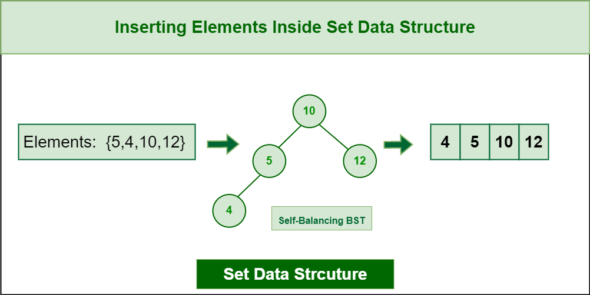
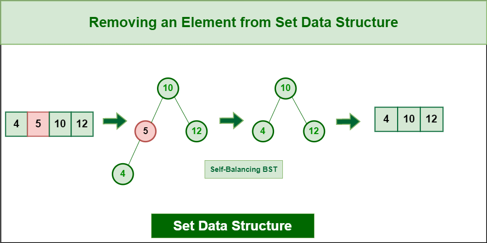

# Set

## Introduction

In Python, a **set** is an unordered collection of unique elements. Sets are used to store distinct items and perform set operations such as union, intersection, difference, and more.


## What is a Set?

A set is a collection of elements without any duplicate entries. Each element in a set is unique, and the order of elements is not guaranteed. Sets are mutable, meaning you can add or remove elements from them.

Sets are commonly used when dealing with collections of unique items, such as:

- Removing duplicates from a list.
- Checking membership of an element.
- Performing set operations like union, intersection, and difference.


## Implementations of Sets:

In Python, you can create sets using curly braces `{}` or the `set()` constructor. Let's see some examples:

### Creating Sets

```python
# Creating a set with curly braces
my_set = {3, 8, 2, 4, 5}

# Creating a set using set() constructor
another_set = set([3, 8, 2, 4, 5])
```

### Operations on Sets
- Adding Elements: Use the add() method to add a single element to a set.
- Removing Elements: Use the remove() or discard() method to remove an element from a set.
- Checking Membership: Use the in keyword to check if an element is present in a set.

```python
my_set = {1, 2, 3}

# Adding an element
my_set.add(4)

# Removing an element
my_set.remove(2)

# Checking membership
if 3 in my_set:
    print("3 is present in the set.")
```

### Set Operations

Python provides several built-in methods for performing set operations:

- Union: Combines elements from two sets into a new set.
- Intersection: Returns a set containing only the elements that are common to both sets.
- Difference: Returns a set containing elements present in the first set but not in the second set.
- Subset: Checks if one set is a subset of another set.
- Superset: Checks if one set is a superset of another set.

```python
# Define two sets
set1 = {1, 2, 3, 4, 5}
set2 = {4, 5, 6, 7, 8}

# Union: Combines elements from both sets
union_set = set1.union(set2)
print("Union:", union_set)  # Output: {1, 2, 3, 4, 5, 6, 7, 8}

# Intersection: Returns elements common to both sets
intersection_set = set1.intersection(set2)
print("Intersection:", intersection_set)  # Output: {4, 5}

# Difference: Returns elements in set1 but not in set2
difference_set = set1.difference(set2)
print("Difference (set1 - set2):", difference_set)  # Output: {1, 2, 3}

# Subset: Checks if set1 is a subset of set2
subset_check = set1.issubset(set2)
print("Is set1 a subset of set2?", subset_check)  # Output: False

# Superset: Checks if set1 is a superset of set2
superset_check = set1.issuperset(set2)
print("Is set1 a superset of set2?", superset_check)  # Output: False
```


## Efficiency of Set Operations

### Adding Elements
Adding an element to a set is typically very efficient. In Python, the `add()` method has an average time complexity of O(1).

### Removing Elements
Similarly, removing an element from a set is also very efficient. In Python, both the `remove()` and `discard()` methods have an average time complexity of O(1).

### Checking Membership
Checking whether an element is present in a set is highly efficient. In Python, using the `in` operator to check membership has an average time complexity of O(1).

### Set Operations
Set operations such as union, intersection, and difference can vary in efficiency depending on the size of the sets involved. In Python, these operations are typically implemented using hash tables, resulting in average time complexities of O(n).


## Images of Set Data Structure


This is a visual representation of inserting an element into a set.


This is a visual representation of removing an element from a set.

Both of these images can be found on the following website:
[GeeksForGeeks.org](https://www.geeksforgeeks.org/introduction-to-set-data-structure-and-algorithm-tutorials/)


## Challenge: Finding Common Elements

Write a Python function `find_common_elements(set1, set2)` that takes two sets `set1` and `set2` as input and returns a new set containing the elements that are common to both sets.
